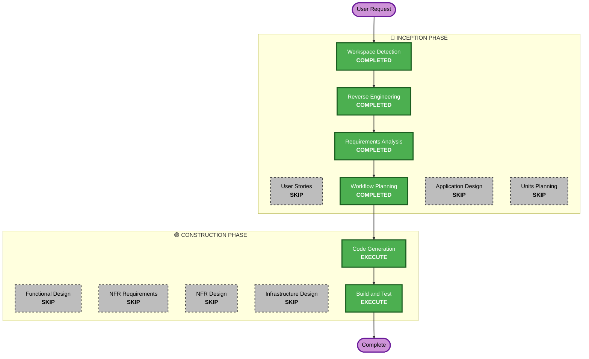

# Execution Plan — Reorganización de estructura del proyecto

## Detailed Analysis Summary

### Transformation Scope (Brownfield)
- **Transformation Type**: Refactor estructural de un solo componente (`App.jsx`) hacia módulos por feature. No es transformación arquitectónica (sigue siendo SPA Vite+React+Supabase).
- **Primary Changes**: Extraer `Login`, vistas, formularios y llamadas a Supabase de `App.jsx` en `src/features/{cuentas,tarjetas,movimientos}` y `src/shared`.
- **Related Components**: `main.jsx` (actualiza el import de `App`), `supabaseClient.js` (se mueve a `src/shared/lib`), `package.json` (se agregan devDependencies de testing).

### Change Impact Assessment
- **User-facing changes**: No — comportamiento y estilos idénticos.
- **Structural changes**: Sí — nueva jerarquía de carpetas `src/`.
- **Data model changes**: No.
- **API changes**: No — mismas tablas/RPCs de Supabase.
- **NFR impact**: No — sin cambios de performance/seguridad/escalabilidad.

### Component Relationships
- **Primary Component**: `App.jsx` (raíz de todo el frontend)
- **Shared Components**: cliente Supabase, `Login`, formato moneda/fecha, catálogo `ACCIONES`
- **Dependent Components**: `main.jsx` (entry point)
- **Supporting Components**: config de Vite/testing

### Risk Assessment
- **Risk Level**: Low
- **Rollback Complexity**: Easy (cambio contenido en el árbol de archivos, sin tocar Supabase)
- **Testing Complexity**: Simple (smoke tests por feature + verificación manual del build)

## Estructura de carpetas propuesta

```
src/
├── main.jsx
├── App.jsx                      # solo decide Login vs MainApp (sesión)
├── shared/
│   ├── lib/
│   │   └── supabaseClient.js
│   ├── auth/
│   │   └── Login.jsx
│   ├── format.js                # fmt, fmtFecha
│   └── constants.js             # ACCIONES
├── features/
│   ├── cuentas/
│   │   ├── useCuentas.js        # fetch + addCuenta + deleteCuenta
│   │   ├── CuentaTicket.jsx
│   │   ├── CuentasManager.jsx   # vista "cuentas" (bloque de cuentas)
│   │   └── CuentasManager.test.jsx
│   ├── tarjetas/
│   │   ├── useTarjetas.js       # fetch + addTarjeta + deleteTarjeta
│   │   ├── TarjetaTicket.jsx
│   │   ├── TarjetaCardVisual.jsx
│   │   ├── TarjetasManager.jsx  # vista "cuentas" (bloque de tarjetas)
│   │   └── TarjetasManager.test.jsx
│   └── movimientos/
│       ├── useMovimientos.js    # fetch + commitMovimiento + deleteMovimiento
│       ├── MovimientoRow.jsx
│       ├── MovimientoWizard.jsx # bottom sheet de 3 pasos
│       ├── HistorialView.jsx    # vista "historial"
│       └── MovimientoWizard.test.jsx
└── pages/
    └── InicioView.jsx           # vista "inicio" (resumen + compone las 3 features)
MainApp.jsx (en src/) orquesta: fetch inicial, `view` state, y renderiza pages/InicioView, features/movimientos/HistorialView, o el manager de cuentas/tarjetas
vitest.config.js / vitest setup en la raíz del repo
```

Nota: cada componente conserva su `<style>` inline actual (fuera de alcance refactorizar CSS).

## Workflow Visualization



## Phases to Execute

### 🔵 INCEPTION PHASE
- [x] Workspace Detection (COMPLETED)
- [x] Reverse Engineering (COMPLETED)
- [x] Requirements Analysis (COMPLETED)
- [x] User Stories — SKIP (refactor interno, sin impacto de UX, sin ambigüedad de negocio)
- [x] Execution Plan (this document)
- [ ] Application Design — SKIP (no hay servicios/componentes nuevos con reglas de negocio propias; solo se extrae UI existente)
- [ ] Units Planning/Generation — SKIP (unidad única, no hay decomposición en servicios independientes)

### 🟢 CONSTRUCTION PHASE
- [ ] Functional Design — SKIP (sin lógica de negocio nueva ni modelos de datos nuevos)
- [ ] NFR Requirements — SKIP (sin requisitos de performance/seguridad nuevos)
- [ ] NFR Design — SKIP
- [ ] Infrastructure Design — SKIP (sin cambios de infraestructura/despliegue)
- [ ] Code Generation — EXECUTE (ALWAYS) — extraer módulos según estructura propuesta + configurar Vitest/RTL
- [ ] Build and Test — EXECUTE (ALWAYS) — `npm run build` + `npm run test`, verificación manual de paridad visual/funcional

## Estimated Timeline
- **Total Phases**: 2 activas (Code Generation, Build and Test)
- **Estimated Duration**: Una sola sesión de trabajo (cambio contenido, sin dependencias externas)

## Success Criteria
- **Primary Goal**: `App.jsx` deja de ser un archivo monolítico; código organizado por feature.
- **Key Deliverables**: Nueva estructura `src/`, `vitest` configurado, smoke tests por feature, build funcionando igual que antes.
- **Quality Gates**: `npm run build` sin errores, `npm run dev` funcionalmente idéntico, tests nuevos en verde.
